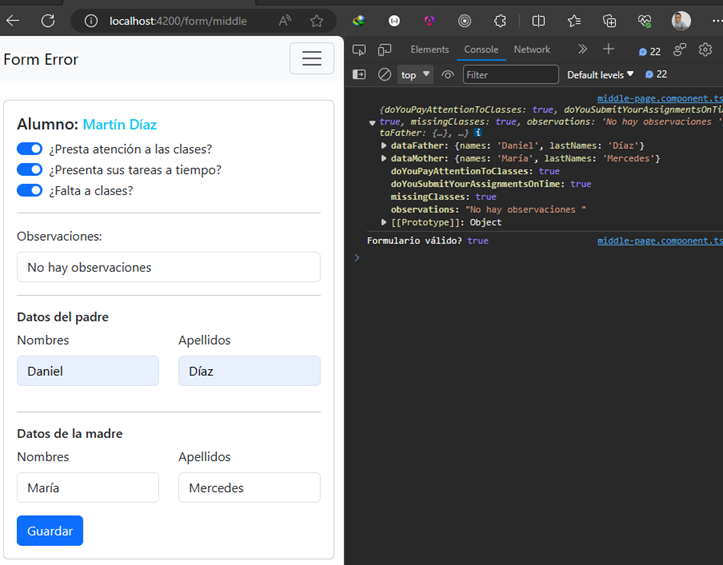
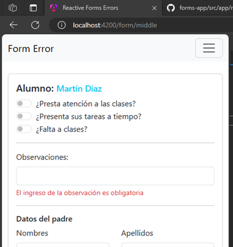

# [Reactive Forms Avanzado - Errores de Validación, el poder de las directivas](https://www.youtube.com/watch?v=ALhaqz32WpM)

This project was generated with [Angular CLI](https://github.com/angular/angular-cli) version 17.0.0.

## Validators con Mensajes (NgxValidator)

### Construyendo formulario sin validación

Para poder ejemplificar las validaciones vamos a crear un nuevo formulario con componentes reutilizables, es decir, vamos a agrupar en un nuevo componente, un grupo de campos que reutilizaremos. Este ejemplo lo hemos visto en el proyecto [reactive-forms-angular](https://github.com/magadiflo/reactive-forms-angular.git) del mismo canal de LogiDev, por lo que tomaremos como referencia el de `advanced-one-page`. 

A continuación se muestra el formulario con reutilización de componentes que vamos a trabajar:

Lo primero que haremos será crear nuestros modelos para poder tipar los fomularios:

````typescript
import { FormControl } from "@angular/forms";

export interface IPersonDataForm {
  names: FormControl<string>;
  lastNames: FormControl<string>;
}

export interface IStudentMiddleForm {
  doYouPayAttentionToClasses: FormControl<boolean>,
  doYouSubmitYourAssignmentsOnTime: FormControl<boolean>,
  missingClasses: FormControl<boolean>,
  observations: FormControl<string>,
}
````

Continuamos creando un nuevo componente que será el que reutilizaremos y con el que aplicaremos el concepto de `ControlContainer`. Ese componente será `person-data-middle`:

`person-data-middle.component.html`
````html
<h6>{{ title }}</h6>
<div class="row" [formGroupName]="formGroupName">
  <div class="col-6">
    <div class="mb-3">
      <label for="names" class="form-label">Nombres</label>
      <input type="text" class="form-control" id="names" formControlName="names">
    </div>
  </div>
  <div class="col-6">
    <div class="mb-3">
      <label for="lastName" class="form-label">Apellidos</label>
      <input type="text" class="form-control" id="lastName" formControlName="lastNames">
    </div>
  </div>
</div>
````

`person-data-middle.component.ts`
````typescript
@Component({
  selector: 'person-data-middle',
  standalone: true,
  imports: [ReactiveFormsModule],
  templateUrl: './person-data-middle.component.html',
  styles: ``,
  viewProviders: [
    {
      provide: ControlContainer,
      useFactory: () => inject(ControlContainer, { skipSelf: true })
    }
  ]
})
export class PersonDataMiddleComponent implements OnInit {

  @Input({ required: true }) title: string = '';
  @Input({ required: true }) formGroupName: string = '';

  private _formBuilder = inject(NonNullableFormBuilder);
  private _parentContainer = inject(ControlContainer);

  public get parentFormGroup(): FormGroup {
    return this._parentContainer.control as FormGroup;
  }

  public get formGroupChild(): FormGroup<IPersonDataForm> {
    return this._formBuilder.group<IPersonDataForm>({
      names: this._formBuilder.control('', { validators: [Validators.required] }),
      lastNames: this._formBuilder.control('', { validators: [Validators.required] })
    });
  }

  ngOnInit(): void {
    this.parentFormGroup.addControl(this.formGroupName, this.formGroupChild);
  }

}
````

Finalmente, implementamos el formulario principal:

````html
<form [formGroup]="formGroup" (ngSubmit)="saveData()">
  <div class="section-check">
    <div class="form-check form-switch">
      <input class="form-check-input" type="checkbox" role="switch" id="flexSwitchCheckChecked1"
        formControlName="doYouPayAttentionToClasses">
      <label class="form-check-label" for="flexSwitchCheckChecked1">¿Presta atención a las clases?</label>
    </div>
    <div class="form-check form-switch">
      <input class="form-check-input" type="checkbox" role="switch" id="flexSwitchCheckChecked2"
        formControlName="doYouSubmitYourAssignmentsOnTime">
      <label class="form-check-label" for="flexSwitchCheckChecked2">¿Presenta sus tareas a tiempo?</label>
    </div>
    <div class="form-check form-switch">
      <input class="form-check-input" type="checkbox" role="switch" id="flexSwitchCheckChecked3"
        formControlName="missingClasses">
      <label class="form-check-label" for="flexSwitchCheckChecked3">¿Falta a clases?</label>
    </div>
  </div>
  <hr>
  <div class="mb-3">
    <label for="name-father" class="form-label">Observaciones:</label>
    <input type="text" class="form-control" id="name-father" formControlName="observations">
  </div>
  <hr>
  <div class="section-parents">
    <person-data-middle title="Datos del padre" formGroupName="dataFather" />
    <hr>
    <person-data-middle title="Datos de la madre" formGroupName="dataMother" />
  </div>
  <div class="col-auto">
    <button type="submit" class="btn btn-primary">Guardar</button>
  </div>
</form>
````

````typescript
@Component({
  selector: 'middle-page',
  standalone: true,
  imports: [ReactiveFormsModule, PersonDataMiddleComponent],
  templateUrl: './middle-page.component.html',
  styles: ``
})
export class MiddlePageComponent {

  private _formBuilder = inject(NonNullableFormBuilder);

  public formGroup: FormGroup = this._formBuilder.group<IStudentMiddleForm>({
    doYouPayAttentionToClasses: this._formBuilder.control(false),
    doYouSubmitYourAssignmentsOnTime: this._formBuilder.control(false),
    missingClasses: this._formBuilder.control(false),
    observations: this._formBuilder.control('', { validators: [Validators.required] })
  });

  public saveData(): void {
    console.log(this.formGroup.value);
    console.log("Formulario válido?", this.formGroup.valid);
  }

}
````

Luego de eso, veremos que el formulario está funcionando correctamente, pero obviamente aún falta manejar las validaciones:



### Construyendo validadores con mensajes personalizados

En este apartado construiremos una clase personalizada llamada `NgxValidators` donde construiremos el mensaje a retornar en función de algún validador:

````typescript
import { AbstractControl, ValidationErrors, ValidatorFn, Validators } from "@angular/forms";

const VALIDATOR_MESSAGE_DEFAULT = {
  required: 'Este campo es requerido',
  email: 'Ingrese un email válido',
  max: 'Excede el valor máximo, max:${max} valor actual:${current}',
}

export class NgxValidators {

  public static required(message?: string): ValidatorFn {
    return (control: AbstractControl): ValidationErrors | null => {
      const error = Validators.required(control);
      return error ? { required: this._getMessage('required', message) } : null;
    }
  }

  public static email(message?: string): ValidatorFn {
    return (control: AbstractControl): ValidationErrors | null => {
      const error = Validators.email(control);
      return error ? { email: this._getMessage('email', message) } : null;
    }
  }

  public static max(max: number, message?: string): ValidatorFn {
    return (control: AbstractControl): ValidationErrors | null => {
      const maxFunction = Validators.max(max);
      const error = maxFunction(control);
      return error ? { max: this._getMessage('max', message, [{ max: 12, current: 18 }]) } : null;
    }
  }

  private static _getMessage(validator: keyof typeof VALIDATOR_MESSAGE_DEFAULT,
    message?: string, paramsMessage?: { [key: string]: unknown }[]) {

    if (message) return message;

    let messageControl = VALIDATOR_MESSAGE_DEFAULT[validator];
    const existParams = paramsMessage && paramsMessage.length > 0;

    if (existParams) {
      paramsMessage.forEach(params => {
        Object.keys(params)
          .filter(key => params[key])
          .forEach(key => {
            messageControl = messageControl.replace(`\${${key}}`, params[key]!.toString());
          });
      });
    }

    return messageControl;
  }

}
````

### Obteniendo el mensaje de error

Antes de empezar a usar la personalización de los validadores necesitamos crear una función que obtendrá el mensaje de error según el error del campo. Para eso necesitamos crear un nuevo archivo llamado `funcitons-form.ts` y dentro de él crearemos la función `getFormControlError()`:

````typescript
import { AbstractControl, ValidationErrors } from "@angular/forms";

const ERRORS_DEFAULT: ValidationErrors = {
  required: 'Este campo es requerido',
  email: 'Ingrese un email válido',
}

export const getFormControlError = (abstractControl: AbstractControl): string => {
  if (!abstractControl.errors || !abstractControl.touched) return '';

  const firstErrorKey = Object.keys(abstractControl.errors)[0];

  if (abstractControl.errors[firstErrorKey] === true) { // (1)
    return ERRORS_DEFAULT[firstErrorKey];
  }
  return abstractControl.errors[firstErrorKey] ?? '';
}
````

**DONDE**
- `(1)`, se realiza la comprobación con la finalidad de determinar si el mensaje que se retorna es el objeto que por defecto nos retorna las validaciones de Angular. Por ejemplo, cuando un campo es requerido y salta esa validación, el objeto de validación que retorna Angular es `{ "required": true }` indicando que el campo es requerido. En nuestro caso, si eso es así, entonces retornaremos un mensaje por defecto, de esta manera evitamos retornar como mensaje el valor true.

Ahora, en el componente `middle-page.component.ts` utilizamos el validador que hemos creado en el apartado anterior asignándole un mensaje personalizado:

````typescript
@Component({
  selector: 'middle-page',
  standalone: true,
  imports: [ReactiveFormsModule, PersonDataMiddleComponent],
  templateUrl: './middle-page.component.html',
  styles: ``
})
export class MiddlePageComponent {

  private _formBuilder = inject(NonNullableFormBuilder);

  public formGroup: FormGroup = this._formBuilder.group<IStudentMiddleForm>({
    doYouPayAttentionToClasses: this._formBuilder.control(false),
    doYouSubmitYourAssignmentsOnTime: this._formBuilder.control(false),
    missingClasses: this._formBuilder.control(false),
    observations: this._formBuilder.control('', { validators: [NgxValidators.required('El ingreso de la observación es obligatoria')] }) // (1)
  });

  public saveData(): void {
    this.formGroup.markAllAsTouched();
    console.log(this.formGroup.value);
    console.log("Formulario válido?", this.formGroup.valid);
  }

  public getError(abstractControl: AbstractControl): string {
    return getFormControlError(abstractControl);
  }

}
````

**DONDE**
- `(1)`, estamos haciendo uso de nuestro validador personalizado y le estamos definiendo un mensaje por defecto. Ahora, también podríamos usar el validador de Angular, por ejemplo `Validators.required` y cuando se muestre el mensaje en el html se mostrará un mensaje por defecto que especificamos en el archivo `funcitons-form.ts`.
- `getError(abstractControl: AbstractControl)`, agregamos un método que llama a la función `getFormControlError()` para mostrar el mensaje.

Finalmente, en el componente `middle-page.component.html` hacemos uso del método `getError()` para mostrar el mensaje de error:

````html
<form [formGroup]="formGroup" (ngSubmit)="saveData()">
  <!-- other tags -->
  <div class="mb-3">
    <label for="name-father" class="form-label">Observaciones:</label>
    <input type="text" class="form-control" id="name-father" formControlName="observations">
    <div class="form-text text-danger">
      {{ getError(formGroup.controls['observations']) }}
    </div>
  </div>
  <!-- other tags -->
</form>
````



## Directivas en Angular

Veamos rápidamente el atributo `selector` de una directiva y cuáles son las formas en las que se pueden definir. Supongamos que creamos dos directivas, uno con el selector sin corchetes y otro con corchetes, **¿cuál es la diferencia?**:

- `@Directive({ selector: 'myDirective'})`, este selector busca un `elemento (etiqueta)` llamada `<myDirective>` en el DOM. El selector está configurado para coincidir con el nombre del elemento directamente.
  > **Ejemplo:**<br>
  > `<myDirective></myDirective>`

- `@Directive({ selector: '[myDirective]'})`, este selector utliza una `notación de atributo` y busca un elemento que tenga un atributo `myDirective`. El selector está configurado para coincidir con elementos que tienen el atributo `myDirective` independientemente del valor especificado de ese atributo.
  > **Ejemplo:**<br>
  > `<some-tag myDirective='algún valor'></some-tag>`

**NOTA**
> La propiedad `selector` del decorador `@Directive` es un selector CSS.

## Directiva para capturar el Submit de los Form

Crearemos la siguiente directiva que capturará el `submit` de un formulario `form`:

````typescript
@Directive({
  selector: 'form', // Selecciona la etiqueta html <form>
  standalone: true
})
export class FormSubmitDirective {

  private readonly _host: ElementRef<HTMLFormElement> = inject(ElementRef); //Injectamos el Form
  public sumit$ = fromEvent(this.element, 'submit').pipe(shareReplay(1));// Capturamos el evento `submit` del form

  public get element() {
    return this._host.nativeElement;
  }

  constructor() {
    console.log('FormSubmitDirective');
  }

}
````

**DONDE**
- `shareReplay(1)`, comparte el Observable fuente entre varios suscriptores, repitiendo las últimas n emisiones con cada suscripción.
